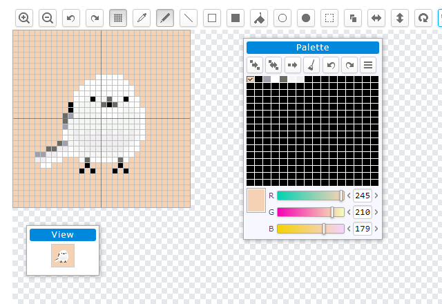

dot_editor
==========

これはブラウザで動くドット絵エディタなのだ

https://dot-a.herokuapp.com/



## 描画API

canvas.jsの関数

### 画像のインデックスデータを作る

幅と高さを指定して画像のインデックスデータを作る。

```javascript
function createIndexData(w, h)
```

- w: 画像の幅
- h: 画像の高さ

### 画像のパレットデータを作る

```javascript
function createPaletteData(n)
```

- n: パレット数

### 点を描く

キャンバスに点を描く。

```javascript
function drawDot(ctx, x, y, indexData, paletteIndex, scale)
```

- ctx: Canvasのコンテキスト
- x, y: 座標
- indexData: 画像のインデックスデータ
- paletteIndex: パレット番号
- scale: 拡大率

### 直線を描く

キャンバスに線を描く。

```javascript
function drawLine(ctx, x0, y0, x1, y1, indexData, paletteIndex, scale)
```

- ctx: Canvasのコンテキスト
- x0, y0: 開始座標
- x1, y1: 終了座標
- indexData: 画像のインデックスデータ
- paletteIndex: パレット番号
- scale: 拡大率

### 円を描く

キャンバスに楕円を描く。

```javascript
function drawEllipse(ctx, x0, y0, x1, y1, indexData, paletteIndex, scale)
```

- ctx: Canvasのコンテキスト
- x0, y0: 楕円に外接する四角形の左上の座標
- x1, y1: 楕円に外接する四角形の右下の座標
- indexData: 画像のインデックスデータ
- paletteIndex: パレット番号
- scale: 拡大率

### 画像を消す

キャンバスを透明にしてインデックスデータを0にする。

```javascript
function clear(ctx, indexData)
```

- ctx: Canvasのコンテキスト
- indexData: 画像のインデックスデータ

### 白黒画像を表示するサンプルコード

```javascript
const ctx = document.getElementById('canvas').getContext('2d');
const image = createIndexData(24, 24);

render(ctx, image, 16);

function render(ctx, image, scale) {
    const data = image.data;
    const w = image.width;
    const h = image.height;
    scale = scale || ctx.canvas.width / image.width;
    ctx.fillStyle = '#FFF';
    ctx.fillRect(0, 0, ctx.canvas.width, ctx.canvas.height);
    ctx.fillStyle = '#000';
    for(let i = 0; i < h; i++) {
        for(let j = 0; j < w; j++) {
            // 画像データが0でない部分を塗りつぶす
            if(data[i * w + j]) {
                ctx.fillRect(j * scale, i * scale, scale, scale);
            }
        }
    }
}
```

## 画像のエンコード、デコードAPI

base64.jsの関数

### 1ビット画像をパックしてURLにする

```javascript
const data = pack(image.data);
const hash = Base64.encode(data);
location.hash = hash;
```

### URLを1ビット画像にする

```javascript
const hash = location.hash.slice(1);

if(hash) {
    const data = Base64.decode(hash);
    unpack(data, image.data);
}
```
