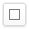

## ドット絵とは

ドット絵とは明確な定義はありませんが、1ドット1ドット描いていく絵のことです。
このサイトでは256色までの絵を描くことができます。

## このサイトについて

ブラウザ上でドット絵を描くことができるサイトです。
描いたドット絵をTwitterに投稿することができます。

## 動作環境

解像度480x800以上のディスプレイでご覧ください。

以下のPCでのブラウザの最新版で動作確認をしています。

- Google Chrome
- Firefox
- Opera
- Internet Explorer 11

## ツールのヘルプ

ドット絵を描くためのツールの説明です。

### ペン

ペンツールを選択している状態でキャンバスの上で左クリックしてドラッグすることで線を描くことができます。

### スポイト

キャンバスから色を拾います。
キャンバスの取得したい色の上で右クリックするとスポイト機能が使えます。
Altキーと左クリックでもスポイト機能が使えます。

### ズーム

表示領域を拡大・縮小します。
ショートカットキーでも拡大(Z)、縮小(X)させることができます。
等倍(C)で100%になります。

### 直線

直線ツールを選択して、キャンバスの上で左クリックしてドラッグすると直線が引けます。
ドラッグしている状態で右クリックした場合はキャンセルします。

### 矩形、塗りつぶし矩形

矩形ツールを選択して、キャンバス上で矩形の開始点を左クリックして終了点までドラッグします。
ドラッグした範囲に矩形が描画されます。
塗りつぶしの矩形ツールを選択している場合は、塗りつぶされた矩形が描けます。

### 円、塗りつぶし円

ツールバーから円ツールを選択します。キャンバスの上で左クリックしてドラッグすると円が描けます。
塗りつぶしの円ツールを選択してる場合は、中が塗りつぶされた円が描けます。

### バケツ(塗りつぶし)

同じ色の領域を塗りつぶします。
バケツツールを選択します。クリックした領域を選択されている色で塗りつぶします。

### 選択範囲

+ 選択範囲アイコンをクリックします。
+ キャンバス上をクリックしてドラッグすると選択範囲が作られます。
+ 選択範囲上でドラッグすると選択した領域を移動できます。
+ 選択範囲以外をクリックするか、他のツールアイコンをクリックすると選択範囲が解除されます。

### 左右反転、上下反転、回転

クリックすると画像を左右反転させます。

## パレット

+ ペンなどのツールで使う色を選択できます。
+ パレットは最大256色まで使うことができます。

### 色を作る

保存したいセルを左クリックします。

