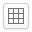

## ドット絵とは

ドット絵とは明確な定義はありませんが、1ドット(ピクセル)ずつ描いていく絵のことです。
このサイトでは256色までの色でドット絵を描くことができます。

## このサイトについて

ブラウザ上でドット絵を描くことができるサイトです。
描いたドット絵をTwitterに投稿することができます。

## 動作環境

解像度480x800以上のディスプレイでご覧ください。

以下のPCでのブラウザの最新版で動作確認をしています。

- Google Chrome
- Firefox
- Opera

## ツールのヘルプ

ドット絵を描くためのツールの説明です。

### ペン

ペンツールを選択している状態でキャンバスの上で左クリックしてドラッグすることで線を描くことができます。

### スポイト

キャンバスに描かれている絵から色を拾います。
キャンバスの取得したい色の上で右クリックするとスポイト機能が使えます。
スポイトアイコンをクリックして色の上で左クリック、もしくはAltキーと左クリックでもスポイト機能が使えます。

### ズーム

表示領域を拡大・縮小します。
ショートカットキーでも拡大(Z)、縮小(X)させることができます。
等倍(C)で100%になります。

### グリッド

グリッドを表示します。

### 直線

直線ツールを選択して、キャンバスの上で左クリックしてドラッグすると直線が引けます。
ドラッグしている状態で右クリックした場合はキャンセルします。

### 矩形、塗りつぶし矩形

矩形ツールを選択して、キャンバス上で矩形の開始点を左クリックして終了点までドラッグします。
ドラッグした範囲に矩形が描画されます。
塗りつぶしの矩形ツールを選択している場合は、塗りつぶされた矩形が描けます。

### 円、塗りつぶし円

ツールバーから円ツールを選択します。キャンバスの上で左クリックしてドラッグすると円が描けます。
塗りつぶしの円ツールを選択してる場合は、中が塗りつぶされた円が描けます。

### バケツ(塗りつぶし)

同じ色の領域を塗りつぶします。
バケツツールを選択します。クリックした領域を選択されている色で塗りつぶします。

### トーン

クリックした領域を網目状に塗りつぶします。

### アウトライン

クリックした領域を縁取りします。

### 選択範囲

+ 選択範囲アイコンをクリックします。
+ キャンバス上をクリックしてドラッグすると選択範囲が作られます。
+ 選択範囲上でドラッグすると選択した領域を移動できます。
+ 選択範囲以外をクリックするか、他のツールアイコンをクリックすると選択範囲が解除されます。

### コピー、貼り付け

選択範囲が指定されているときにクリックすると選択範囲領域をコピーして貼り付けます。

### 左右反転、上下反転、回転

クリックすると画像を左右反転、回転させます。

### 画像の移動

矢印の方向に1ドットずつ画像を移動させます。画像の端は反対側に移動します。

### 下絵の表示

画像ファイルを読み込んで下絵として表示できます。

### Twitterへの投稿

Twitterアイコンをクリックすると描いた絵をTwitterへ投稿することができます。

### 保存、読み込み

ブラウザに描いている絵を保存します。最大9つまで保存できます。

## パレット

+ ペンなどのツールで使う色を選択できます。
+ パレットは最大256色まで使うことができます。

### 色を作る

パレットで保存したいセルを左クリックします。
スライダーからRGBの値を調節します。

### 色のコピー

選択されたセルの色をコピーします。

### 色の入れ替え

選択されたセルの色を入れ替えます。

### 色の移動

選択されたセルを移動します。

### 未使用色の削除

クリックすると使われていない色をパレットから削除します。

### 16進数表記

クリックすると色の数値を16進数で表示します。

### グラデーション

選択されたセルの色から次にクリックしたセルの色へのグラデーションを作成します。
